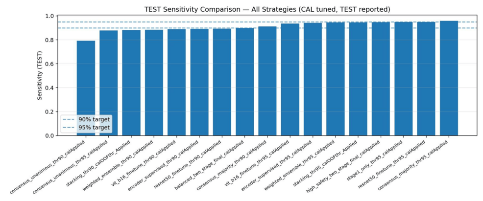
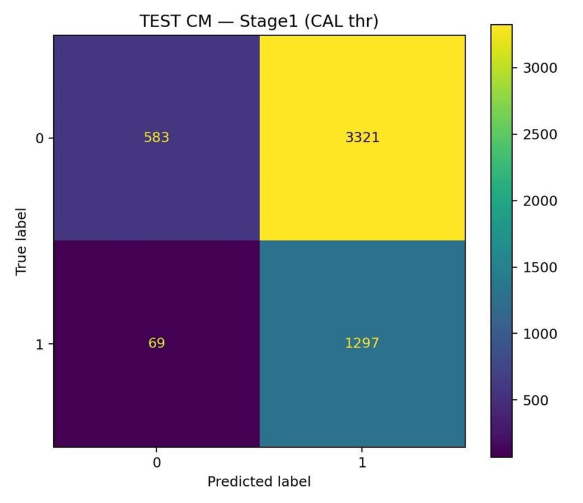
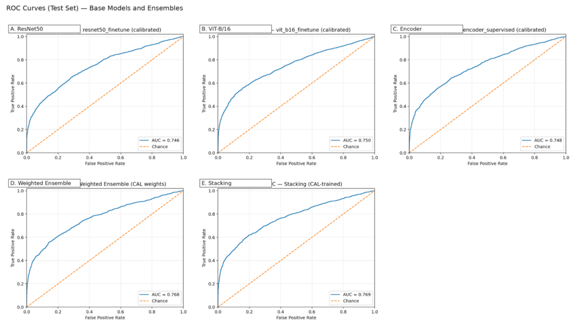

# Beyond the Model: AI Decision Strategies for Diabetic Retinopathy Screening


This repository contains the code framework, documentation, and reproducible project structure for a diabetic retinopathy screening study focused on **clinical decision strategy**, not just model accuracy.

The project evaluates how different AI decision strategies perform under realistic clinical constraints, especially when a screening system must maintain high sensitivity while reducing unnecessary referrals.

## Project Motivation

Diabetic retinopathy is a major cause of preventable blindness, but early detection can reduce long-term vision loss. AI models can help scale screening, yet real clinical deployment requires more than high AUC or accuracy. A useful screening system must prioritize patient safety while also reducing false positives that burden clinics and patients.

This project asks:

> Under fixed clinical sensitivity targets, which AI decision strategies reduce unnecessary referrals most effectively?

## Core Research Idea

Instead of only comparing deep learning architectures, this project compares **decision strategies** applied after model prediction.

The study evaluates:

- Single-model thresholding
- Majority consensus voting
- Weighted probability averaging
- Stacking with a logistic regression meta-classifier
- A two-stage decision pipeline

Each strategy is tested under fixed sensitivity targets, such as 95% and 90%, to reflect clinical safety requirements.

## Dataset

The project is designed around retinal fundus image classification using the EyePACS diabetic retinopathy dataset.

Severity labels are converted into a binary screening task:

- `0`: No referable diabetic retinopathy
- `1`: Referable diabetic retinopathy

A patient-level split is recommended to avoid leakage between training, calibration, and test sets.

## Repository Structure

```text
diabetic-retinopathy-ai/
│
├── README.md
├── requirements.txt
├── LICENSE
├── .gitignore
│
├── configs/
│   └── default_config.yaml
│
├── src/
│   ├── data/
│   │   └── dataset.py
│   ├── models/
│   │   └── model_factory.py
│   ├── training/
│   │   └── train.py
│   ├── calibration/
│   │   └── temperature_scaling.py
│   ├── strategies/
│   │   └── decision_strategies.py
│   ├── evaluation/
│   │   └── metrics.py
│   └── utils/
│       └── seed.py
│
├── notebooks/
│   └── 01_project_overview.ipynb
│
├── results/
│   └── README.md
│
└── docs/
    └── project_summary.md
```

## Methods Overview

### 1. Model Training

The project can support several image classification models, including:

- ResNet50
- Vision Transformer
- Supervised convolutional encoder

Each model outputs a probability score for referable diabetic retinopathy.

### 2. Calibration

Temperature scaling is used to improve probability calibration before threshold selection.

### 3. Clinical Threshold Selection

Thresholds are selected on a calibration set to meet a fixed sensitivity target while maximizing specificity.

This reflects the clinical reality that screening systems often prioritize catching nearly all disease cases.

### 4. Decision Strategy Evaluation

Strategies are compared on a held-out test set using:

- Sensitivity
- Specificity
- False positives
- False negatives
- AUC
- Referral burden

## Results Summary

Detailed strategy comparison tables are available here:

- [Clinical operating point CSV](results/clinical_operating_points.csv)
- [Detailed strategy comparison tables](results/strategy_comparison.md)

The results compare model and ensemble strategies under fixed clinical sensitivity targets. This makes the project focus on real screening deployment constraints rather than only standard classification accuracy.

## Results Visualizations

### Sensitivity Comparison Across Decision Strategies

This figure compares test-set sensitivity across all evaluated strategies. The dashed lines represent the 90% and 95% clinical sensitivity targets.



### Confusion Matrix Example

This confusion matrix shows the tradeoff between true positives, false positives, true negatives, and false negatives for a calibrated decision strategy.



### ROC Curves

The ROC curves compare base models and ensemble strategies on the held-out test set.



## Key Insight

The most important finding from this project is that model choice alone is not enough. The decision rule and sensitivity target can strongly change the clinical usefulness of an AI screening system.

In practical terms, a small threshold or strategy change can determine how many patients are referred for follow-up.

## How to Run

Install dependencies:

```bash
pip install -r requirements.txt
```

Example training command:

```bash
python src/training/train.py --config configs/default_config.yaml
```

Example evaluation command:

```bash
python src/evaluation/metrics.py
```

## Suggested Repository Name

```text
diabetic-retinopathy-ai-decision-strategies
```

## Citation

If referencing this work, cite:

Jena, S. S., & Rayguru, M. M. (2026). *Beyond the Model: Evaluating AI Decision Strategies for Diabetic Retinopathy Screening Under Clinical Constraints*. Cureus.

## Author

**Shlok S. Jena**  
AI/ML Researcher focused on healthcare artificial intelligence, clinical decision strategies, and interpretable machine learning.
